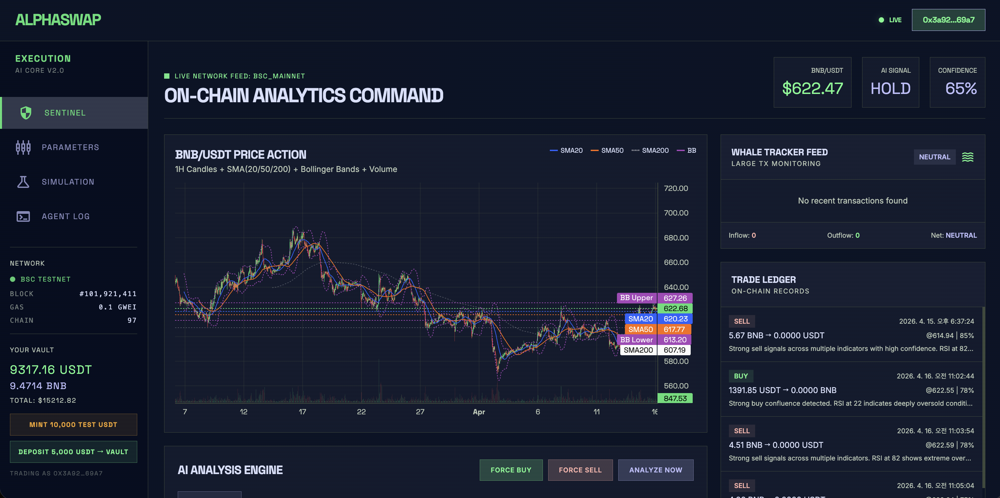

# AlphaSwap

**AI-powered DeFi trading agent on BNB Smart Chain.**

AlphaSwap combines on-chain data with technical indicators, analyzed in real-time by Claude AI, to autonomously execute trades on PancakeSwap.



---

## How It Works

```
Every 60 seconds:

  PancakeSwap V3 slot0()  ──→  Live BNB/USDT price
  Binance 1H OHLCV API    ──→  41 days of candle data + volume
  BSCScan API              ──→  Whale large-transfer detection
          │
          ▼
  ┌──────────────────────────────────┐
  │  Technical Indicators (1H)       │
  │  RSI(14) · MACD(12/26/9)         │
  │  SMA(20/50/200) · EMA(12/26)     │
  │  Bollinger Bands(20, 2σ)         │ 
  └──────────────┬───────────────────┘
                 │
                 ▼
  ┌──────────────────────────────────┐
  │  Claude AI Analysis              │
  │  Synthesizes indicators + whale  │
  │  data into a holistic judgment   │
  │  → BUY / SELL / HOLD             │
  │  → Confidence 0–100 %            │
  │  → Reasoning in natural language │
  └──────────────┬───────────────────┘
                 │
                 ▼  confidence ≥ 70 %
  ┌──────────────────────────────────┐
  │  BSC Testnet Auto-Swap           │
  │  Vault → Router → Token swap     │
  │  Trade recorded on-chain         │
  └──────────────────────────────────┘
```

> **[Read the full technical deep-dive →](HOW_IT_WORKS.md)**

### What Makes the AI Different

This is **not** a rule-based bot ("buy when RSI < 30"). Claude evaluates the **confluence** of all indicators plus on-chain whale activity and makes a holistic judgment:

> *"RSI at 32 suggests an oversold zone, but 3 whale transfers are depositing large BNB amounts to exchanges — signaling additional selling pressure. With the price below the lower Bollinger Band and MACD histogram still expanding negative, it is safer to delay the buy entry."*

---

## Architecture

```
AlphaSwap/
├── contracts/                  # Solidity (Foundry)
│   ├── src/
│   │   ├── Vault.sol           # User deposit/withdraw + agent swap execution
│   │   ├── TradeRegistry.sol   # On-chain trade history storage
│   │   ├── MockRouter.sol      # PancakeSwap V2 Router mock
│   │   └── MockERC20.sol       # Test ERC-20 tokens (USDT, BNB)
│   ├── test/AlphaSwap.t.sol    # 16 unit tests
│   └── script/Deploy.s.sol     # BSC Testnet deployment script
│
├── agent/                      # Python (FastAPI)
│   ├── main.py                 # Server + 60s monitor loop + all API endpoints
│   ├── price_feed.py           # PancakeSwap slot0 price + Binance 1H OHLCV
│   ├── indicators.py           # RSI, MACD, MA, Bollinger Bands (pandas-ta)
│   ├── bsc_onchain.py          # BSCScan whale large-transfer detection
│   ├── ai_analyst.py           # Claude API analysis
│   ├── executor.py             # web3.py swap execution + on-chain recording
│   └── config.py               # Environment variable management
│
├── frontend/
│   └── index.html              # Dashboard — 4 tabs (Sentinel / Parameters / Simulation / Agent Log)
│
└── abi/                        # Frontend ABIs + contract addresses
```

---

## Smart Contracts

| Contract | Description |
|----------|-------------|
| **Vault.sol** | Users deposit/withdraw USDT. Only the authorized agent can call `executeBuy()` / `executeSell()`, swapping tokens through the Router on behalf of users. |
| **TradeRegistry.sol** | Stores every trade on-chain: user, pair, side, amounts, price, AI reasoning, confidence, and timestamp. Fully auditable. |
| **MockRouter.sol** | Mocks the PancakeSwap V2 Router interface. Owner sets exchange rate via `setRate()`. Swap to real Router by changing one address. |
| **MockERC20.sol** | Test ERC-20 tokens with free `mint()`. Used as USDT and BNB on testnet. |

---

## AI Analysis Pipeline

| Step | Module | What It Does |
|------|--------|-------------|
| 1 | **price_feed.py** | Reads live BNB/USDT price from PancakeSwap V3 `slot0()` (gas-free view call on BSC mainnet). Fetches 41 days of 1H OHLCV + volume from Binance API (no key needed). |
| 2 | **indicators.py** | Computes technical indicators with pandas-ta: RSI(14), MACD(12/26/9), SMA(20/50/200), EMA(12/26), Bollinger Bands(20, 2σ). Detects golden/death crosses. |
| 3 | **bsc_onchain.py** | Monitors Binance hot wallets via BSCScan API. Detects large BNB transfers (≥ 200 BNB). Exchange inflow = sell pressure, outflow = accumulation signal. |
| 4 | **ai_analyst.py** | Sends all indicator values + whale data to Claude as structured text. Claude returns JSON: `{ action, confidence, amount_percent, reasoning }`. |
| 5 | **executor.py** | When confidence ≥ threshold: executes swap via Vault contract on BSC Testnet, then records the trade (including AI reasoning) in TradeRegistry. |

---

## Dashboard

Real-time dashboard at `http://localhost:8000` with 4 views:

### Sentinel
- **Candlestick chart** — 1H candles + SMA(20/50/200) + Bollinger Bands + Volume histogram
- **AI Signal panel** — BUY/SELL/HOLD badge, confidence bar, reasoning text
- **Indicator grid** — RSI, MACD, MA, Bollinger values and signals
- **Whale Tracker** — Live feed of large BNB transfers with exchange direction
- **Sentiment Heatmap** — Bull/bear visualization across 4 indicator categories
- **Trade Ledger** — On-chain trade history from TradeRegistry
- **Force Buy/Sell** — Manual trade buttons for demo
- **Wallet connection** — MetaMask/Rabby support; AI trades on behalf of the connected wallet

### Parameters
- Auto-trade ON/OFF, confidence threshold, max trade percentage
- RSI buy/sell thresholds with visual zone bars
- Monitor interval, individual indicator toggles (MACD/MA/BB/Whale)

### Simulation
- Override RSI/MACD/Bollinger/Whale values with sliders
- Quick presets: Strong Buy / Mild Buy / Neutral / Mild Sell / Strong Sell
- AI analyzes overridden indicators — triggers real trades when conditions are met

### Agent Log
- Terminal-style real-time log viewer (price, indicators, AI decisions, trade execution)
- Category filters (AI / Trades / Indicators / Whale / Simulation)
- 10-second auto-refresh with auto-scroll

### Sidebar
- BSC Testnet network status (block number, gas price, connection)
- Vault portfolio balance (connected wallet)
- One-click Mint Test USDT / Deposit to Vault
- MetaMask/Rabby wallet connection with BSC Testnet auto-add

---

## Why BNB Smart Chain

| Reason | Detail |
|--------|--------|
| **Low gas = AI agent viability** | Analyzing every 60s + recording trades on-chain. BSC gas: ~$0.03/tx. On Ethereum that's $5+/tx. |
| **PancakeSwap native** | Largest DEX on BSC. Deep BNB/USDT liquidity. Direct `slot0()` price reads. |
| **Rich on-chain data** | BSCScan API for whale transfer detection. PancakeSwap pool data. |
| **3-second block time** | Signal → execution in one block. |

---

## Quick Start

### Prerequisites

- Python 3.13+
- Foundry (`forge`, `cast`)
- MetaMask or Rabby wallet
- BSC Testnet BNB ([Faucet](https://www.bnbchain.org/en/testnet-faucet))

### 1. Install

```bash
git clone https://github.com/piatoss3612/AlphaSwap.git
cd AlphaSwap

# Python
python3.13 -m venv .venv
source .venv/bin/activate
pip install -r agent/requirements.txt

# Solidity
cd contracts && forge install && cd ..
```

### 2. Configure

```bash
cp .env.example .env
```

Fill in the required keys in `.env`:

| Variable | Purpose |
|----------|---------|
| `ANTHROPIC_API_KEY` | Claude AI analysis |
| `BSCSCAN_API_KEY` | Whale transfer detection |
| `AGENT_PRIVATE_KEY` | BSC Testnet agent wallet |

### 3. Deploy Contracts

```bash
set -a && source .env && set +a
cd contracts
forge script script/Deploy.s.sol --rpc-url $BSC_TESTNET_RPC --broadcast
```

Copy the deployed contract addresses into `.env`.

### 4. Run

```bash
source .venv/bin/activate
cd agent && python main.py
```

Open **http://localhost:8000**

---

## API

| Method | Endpoint | Description |
|--------|----------|-------------|
| GET | `/api/status` | Current price, indicators, AI signal, whale data |
| GET | `/api/ohlcv?days=41` | OHLCV candlestick data (Binance 1H) |
| GET | `/api/whales` | Whale large BNB transfers |
| GET | `/api/trades?count=20` | On-chain trade history |
| GET | `/api/portfolio/{address}` | Vault balances for a wallet |
| GET | `/api/logs?count=100` | Agent activity logs |
| GET | `/api/network` | BSC Testnet block number, gas price, connection |
| GET | `/api/params` | Current trading parameters |
| POST | `/api/params` | Update trading parameters |
| GET | `/api/overrides` | Simulation override values |
| POST | `/api/overrides` | Set simulation overrides |
| POST | `/api/analyze` | Manual analysis / Force Buy / Force Sell |
| POST | `/api/set-user` | Set active wallet for AI trading |

---

## Tech Stack

| Layer | Technologies |
|-------|-------------|
| **Smart Contracts** | Solidity 0.8.20, Foundry, OpenZeppelin |
| **Backend** | Python 3.13, FastAPI, web3.py, pandas-ta |
| **AI** | Anthropic Claude API (`claude-sonnet-4-20250514`) |
| **Frontend** | TailwindCSS, lightweight-charts (TradingView) |
| **Data Sources** | PancakeSwap V3 `slot0()`, Binance OHLCV API, BSCScan API |
| **Chain** | BNB Smart Chain Testnet (chainId: 97) |

---

## Roadmap

| Phase | Description |
|-------|-------------|
| **1 — Hackathon MVP** | Single pair (BNB/USDT), 1H technical indicators + whale detection, BSC Testnet |
| **2 — On-chain expansion** | PancakeSwap pool event parsing, network gas utilization, CAKE APR data |
| **3 — Multi-pair** | Support multiple trading pairs, PancakeSwap V3 mainnet, backtesting engine |
| **4 — Account abstraction** | ERC-4337 Paymaster integration (gas fees paid in USDT) |
| **5 — Strategy marketplace** | Copy trading, multi-chain expansion |

---

## License

MIT
